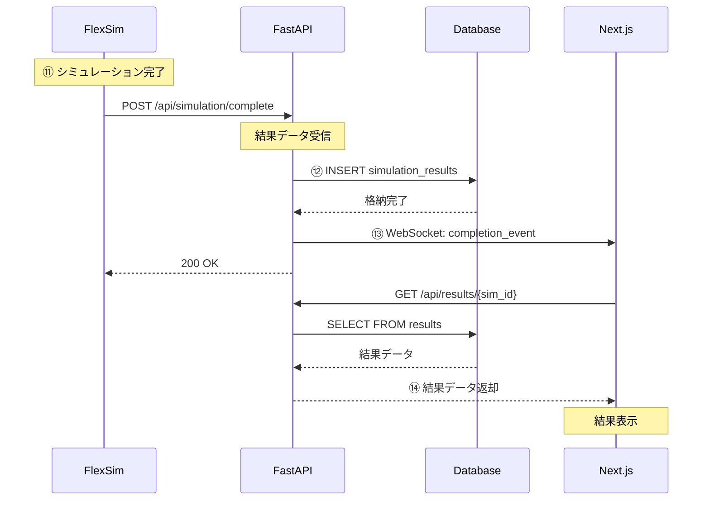

# システム設計書

## 1. システムアーキテクチャ

### 1.1 全体構成図
```
┌─────────────────────────────────────────────────────────┐
│                     展示会場                              │
├─────────────────────────────────────────────────────────┤
│  ┌──────────┐     ┌──────────┐     ┌──────────┐      │
│  │  カメラ   │────▶│ARマーカー│────▶│ ワーク   │      │
│  └──────────┘     └──────────┘     └──────────┘      │
│        │                                                 │
│        ▼                                                 │
│  ┌──────────────────────────────────────┐               │
│  │     フロントエンド (Next.js)          │               │
│  │  - シミュレーション開始画面           │               │
│  │  - 結果表示画面                       │               │
│  │  - 進捗管理ダッシュボード             │               │
│  └──────────────────────────────────────┘               │
│        │            ▲                                    │
│        ▼            │                                    │
│  ┌──────────────────────────────────────┐               │
│  │     バックエンド (FastAPI)            │               │
│  │  - REST API エンドポイント            │               │
│  │  - WebSocket 通信                     │               │
│  │  - ビジネスロジック                   │               │
│  └──────────────────────────────────────┘               │
│        │            ▲                                    │
│        ▼            │                                    │
│  ┌──────────────────────────────────────┐               │
│  │     FlexSim シミュレーター            │               │
│  │  - 工程シミュレーション               │               │
│  │  - タスク評価エンジン                 │               │
│  │  - グローバルテーブル管理             │               │
│  └──────────────────────────────────────┘               │
│        │            ▲                                    │
│        ▼            ▼                                    │
│  ┌──────────────────────────────────────┐               │
│  │     データベース (PostgreSQL)         │               │
│  │  - 工程進捗データ                     │               │
│  │  - シミュレーション結果               │               │
│  │  - マスターデータ                     │               │
│  └──────────────────────────────────────┘               │
└─────────────────────────────────────────────────────────┘
```

### 1.2 コンポーネント設計

#### 1.2.1 フロントエンド層
- **技術**: Next.js 14 (App Router)
- **主要コンポーネント**:
  - SimulationControl: シミュレーション制御
  - ProgressViewer: 進捗表示
  - ResultDashboard: 結果ダッシュボード
  - ARMarkerCapture: ARマーカー認識

#### 1.2.2 バックエンド層
- **技術**: FastAPI (Python 3.11+)
- **主要モジュール**:
  - API Router: エンドポイント管理
  - Service Layer: ビジネスロジック
  - Repository Layer: データアクセス
  - WebSocket Manager: リアルタイム通信

#### 1.2.3 シミュレーション層
- **技術**: FlexSim 2024
- **主要機能**:
  - Task Evaluator: タスク評価
  - Process Simulator: 工程シミュレーション
  - Data Synchronizer: データ同期

## 2. データフロー設計

### 2.1 シミュレーション完了フロー（⑪〜⑭）



### 2.2 通信プロトコル設計

#### 2.2.1 REST API
- **基本URL**: `http://localhost:8000/api`
- **認証**: JWT Bearer Token（展示版では簡略化可）
- **データ形式**: JSON
- **エラー処理**: RFC 7807 Problem Details

#### 2.2.2 WebSocket
- **エンドポイント**: `ws://localhost:8000/ws`
- **イベント種別**:
  - `simulation.started`
  - `simulation.progress`
  - `simulation.completed`
  - `simulation.error`

## 3. モジュール設計

### 3.1 フロントエンド実装例

```typescript
// types/simulation.ts
export interface SimulationResult {
  simulationId: string;
  status: 'pending' | 'running' | 'completed' | 'failed';
  completionTime: Date;
  metrics: {
    totalTime: number;
    completedTasks: number;
    workerUtilization: number;
    bottlenecks: BottleneckInfo[];
  };
  suggestions: Suggestion[];
}

export interface BottleneckInfo {
  tactId: number;
  severity: 'low' | 'medium' | 'high';
  waitTime: number;
  description: string;
}

export interface Suggestion {
  type: 'overtime_reduction' | 'resource_optimization' | 'task_rebalancing';
  impact: number;
  description: string;
  implementation: string;
}
```

```tsx
// components/SimulationDashboard.tsx
import { useState, useEffect } from 'react';
import { SimulationResult } from '@/types/simulation';
import { useWebSocket } from '@/hooks/useWebSocket';

export const SimulationDashboard: React.FC = () => {
  const [result, setResult] = useState<SimulationResult | null>(null);
  const [loading, setLoading] = useState(false);
  const { messages, sendMessage } = useWebSocket('/ws');

  useEffect(() => {
    // WebSocket メッセージ処理
    const latestMessage = messages[messages.length - 1];
    if (latestMessage?.type === 'simulation.completed') {
      fetchResult(latestMessage.simulationId);
    }
  }, [messages]);

  const startSimulation = async () => {
    setLoading(true);
    try {
      const response = await fetch('/api/simulation/start', {
        method: 'POST',
        headers: { 'Content-Type': 'application/json' },
        body: JSON.stringify({ 
          tactConfiguration: getTactConfig(),
          taskQueue: getTaskQueue() 
        })
      });
      const data = await response.json();
      console.log('Simulation started:', data.simulationId);
    } catch (error) {
      console.error('Failed to start simulation:', error);
    }
  };

  const fetchResult = async (simulationId: string) => {
    try {
      const response = await fetch(`/api/results/${simulationId}`);
      const data = await response.json();
      setResult(data);
      setLoading(false);
    } catch (error) {
      console.error('Failed to fetch results:', error);
      setLoading(false);
    }
  };

  return (
    <div className="dashboard">
      <button onClick={startSimulation} disabled={loading}>
        {loading ? 'シミュレーション実行中...' : 'シミュレーション開始'}
      </button>
      
      {result && (
        <div className="results">
          <h2>シミュレーション結果</h2>
          <MetricsDisplay metrics={result.metrics} />
          <BottleneckAnalysis bottlenecks={result.metrics.bottlenecks} />
          <SuggestionsList suggestions={result.suggestions} />
        </div>
      )}
    </div>
  );
};
```

### 3.2 バックエンド実装例

```python
# models/simulation.py
from pydantic import BaseModel
from datetime import datetime
from typing import List, Optional, Literal
from enum import Enum

class SimulationStatus(str, Enum):
    PENDING = "pending"
    RUNNING = "running"
    COMPLETED = "completed"
    FAILED = "failed"

class TaskInfo(BaseModel):
    task_id: int
    name: str
    task_type: Literal["main", "transport"]
    tact_id: int
    standard_time: float
    dependencies: List[int]

class SimulationRequest(BaseModel):
    tact_configuration: dict
    task_queue: List[TaskInfo]
    parameters: Optional[dict] = {}

class SimulationResult(BaseModel):
    simulation_id: str
    status: SimulationStatus
    completion_time: datetime
    total_time: float
    completed_tasks: int
    worker_utilization: float
    bottlenecks: List[dict]
    suggestions: List[dict]

class SimulationCompleteRequest(BaseModel):
    simulation_id: str
    status: Literal["completed", "failed"]
    completion_time: datetime
    result_summary: dict
```

```python
# api/simulation.py
from fastapi import APIRouter, HTTPException, WebSocket
from typing import List
import asyncio
import json
from models.simulation import (
    SimulationRequest, 
    SimulationResult,
    SimulationCompleteRequest
)
from services.simulation_service import SimulationService
from services.flexsim_connector import FlexSimConnector
from database import get_db

router = APIRouter(prefix="/api/simulation")
simulation_service = SimulationService()
flexsim_connector = FlexSimConnector()

# WebSocket接続管理
class ConnectionManager:
    def __init__(self):
        self.active_connections: List[WebSocket] = []
    
    async def connect(self, websocket: WebSocket):
        await websocket.accept()
        self.active_connections.append(websocket)
    
    async def disconnect(self, websocket: WebSocket):
        self.active_connections.remove(websocket)
    
    async def broadcast(self, message: dict):
        for connection in self.active_connections:
            try:
                await connection.send_json(message)
            except:
                pass

manager = ConnectionManager()

@router.post("/start")
async def start_simulation(request: SimulationRequest):
    """シミュレーション開始エンドポイント"""
    try:
        # FlexSimにシミュレーション開始指示
        sim_id = await flexsim_connector.start_simulation(
            tact_config=request.tact_configuration,
            task_queue=request.task_queue
        )
        
        # WebSocketで開始通知
        await manager.broadcast({
            "type": "simulation.started",
            "simulation_id": sim_id,
            "timestamp": datetime.now().isoformat()
        })
        
        return {"simulation_id": sim_id, "status": "started"}
    
    except Exception as e:
        raise HTTPException(status_code=500, detail=str(e))

@router.post("/complete")
async def complete_simulation(request: SimulationCompleteRequest):
    """
    ⑪ FlexSimからのシミュレーション完了通知を受信
    ⑫ 結果をDBに格納
    ⑬ フロントエンドに完了を通知
    """
    try:
        # データベースに結果を保存
        db = next(get_db())
        result = await simulation_service.save_result(
            db=db,
            simulation_id=request.simulation_id,
            status=request.status,
            result_data=request.result_summary
        )
        
        # WebSocketで完了通知
        await manager.broadcast({
            "type": "simulation.completed",
            "simulation_id": request.simulation_id,
            "status": request.status,
            "timestamp": datetime.now().isoformat()
        })
        
        return {"status": "success", "message": "Result saved successfully"}
    
    except Exception as e:
        raise HTTPException(status_code=500, detail=str(e))

@router.get("/results/{simulation_id}")
async def get_simulation_result(simulation_id: str):
    """⑭ シミュレーション結果を取得して返却"""
    try:
        db = next(get_db())
        result = await simulation_service.get_result(db, simulation_id)
        
        if not result:
            raise HTTPException(status_code=404, detail="Result not found")
        
        # 結果データを整形
        return SimulationResult(
            simulation_id=result.simulation_id,
            status=result.status,
            completion_time=result.completion_time,
            total_time=result.total_time,
            completed_tasks=result.completed_tasks,
            worker_utilization=result.worker_utilization,
            bottlenecks=json.loads(result.bottlenecks),
            suggestions=generate_suggestions(result)
        )
    
    except Exception as e:
        raise HTTPException(status_code=500, detail=str(e))

@router.websocket("/ws")
async def websocket_endpoint(websocket: WebSocket):
    """WebSocket接続エンドポイント"""
    await manager.connect(websocket)
    try:
        while True:
            # クライアントからのメッセージを待機
            data = await websocket.receive_text()
            # 必要に応じてメッセージ処理
    except:
        await manager.disconnect(websocket)

def generate_suggestions(result) -> List[dict]:
    """シミュレーション結果から改善提案を生成"""
    suggestions = []
    
    # ボトルネック解消提案
    if result.bottlenecks:
        suggestions.append({
            "type": "resource_optimization",
            "impact": 0.15,
            "description": "ボトルネック工程への人員追加配置",
            "implementation": f"Tact {result.bottlenecks[0]['tact_id']} に作業者を1名追加"
        })
    
    # 残業時間削減提案
    if result.total_time > 480:  # 8時間以上
        overtime = result.total_time - 480
        suggestions.append({
            "type": "overtime_reduction",
            "impact": overtime / 60,
            "description": f"残業時間を{overtime:.1f}分削減可能",
            "implementation": "タスク並列化とスケジュール最適化"
        })
    
    return suggestions
```

### 3.3 FlexSim連携実装

```python
# services/flexsim_connector.py
import asyncio
import json
from typing import Dict, List, Any
import aiohttp
from datetime import datetime

class FlexSimConnector:
    """FlexSimとの通信を管理するコネクタクラス"""
    
    def __init__(self):
        self.base_url = "http://localhost:5000"  # FlexSim HTTP Server
        self.session = None
    
    async def start_simulation(
        self, 
        tact_config: Dict, 
        task_queue: List[Dict]
    ) -> str:
        """FlexSimにシミュレーション開始を指示"""
        
        # シミュレーションIDを生成
        sim_id = f"sim_{datetime.now().strftime('%Y%m%d_%H%M%S')}"
        
        # FlexSim用のデータを準備
        flexsim_data = {
            "simulation_id": sim_id,
            "model_path": "models/production_line.fsm",
            "parameters": {
                "tact_configuration": tact_config,
                "initial_task_queue": task_queue,
                "evaluation_mode": "simple",  # 0/1の単純評価
                "simulation_time": 28800  # 8時間分のシミュレーション
            }
        }
        
        # FlexSimにHTTPリクエストを送信
        async with aiohttp.ClientSession() as session:
            async with session.post(
                f"{self.base_url}/simulation/start",
                json=flexsim_data
            ) as response:
                if response.status != 200:
                    raise Exception(f"FlexSim start failed: {await response.text()}")
                
                result = await response.json()
                return result["simulation_id"]
    
    async def get_simulation_status(self, simulation_id: str) -> Dict:
        """シミュレーションの現在状態を取得"""
        async with aiohttp.ClientSession() as session:
            async with session.get(
                f"{self.base_url}/simulation/{simulation_id}/status"
            ) as response:
                return await response.json()
    
    async def stop_simulation(self, simulation_id: str) -> bool:
        """実行中のシミュレーションを停止"""
        async with aiohttp.ClientSession() as session:
            async with session.post(
                f"{self.base_url}/simulation/{simulation_id}/stop"
            ) as response:
                return response.status == 200
```

## 4. セキュリティ設計

### 4.1 認証・認可
- 展示版では簡易認証（固定トークン）
- 本番版ではJWT + OAuth2.0

### 4.2 データ保護
- HTTPS通信（自己署名証明書）
- SQLインジェクション対策（ORM使用）
- XSS対策（React自動エスケープ）

## 5. エラーハンドリング

### 5.1 エラーコード体系
```python
class ErrorCode(Enum):
    # 4xx クライアントエラー
    INVALID_REQUEST = (400, "Invalid request parameters")
    UNAUTHORIZED = (401, "Authentication required")
    NOT_FOUND = (404, "Resource not found")
    
    # 5xx サーバーエラー
    SIMULATION_FAILED = (500, "Simulation execution failed")
    DATABASE_ERROR = (503, "Database connection error")
    FLEXSIM_UNAVAILABLE = (503, "FlexSim service unavailable")
```

### 5.2 リトライ戦略
- 指数バックオフ（初回1秒、最大32秒）
- 最大リトライ回数：5回
- サーキットブレーカー実装

## 6. パフォーマンス最適化

### 6.1 キャッシング戦略
- Redis使用（オプション）
- 結果データの60分キャッシュ
- 静的データのCDN配信

### 6.2 データベース最適化
- インデックス設計
- コネクションプーリング
- 読み取り専用レプリカ（将来）

## 7. 監視・ログ設計

### 7.1 ログレベル
- ERROR: システムエラー
- WARNING: 性能劣化
- INFO: 主要イベント
- DEBUG: 詳細トレース

### 7.2 メトリクス
- API応答時間
- シミュレーション実行時間
- エラー率
- 同時接続数

## 8. デプロイメント設計

### 8.1 コンテナ構成
```yaml
# docker-compose.yml
version: '3.8'
services:
  frontend:
    build: ./frontend
    ports:
      - "3000:3000"
    environment:
      - NEXT_PUBLIC_API_URL=http://backend:8000
  
  backend:
    build: ./backend
    ports:
      - "8000:8000"
    environment:
      - DATABASE_URL=postgresql://user:pass@db:5432/simulation
      - FLEXSIM_URL=http://flexsim:5000
    depends_on:
      - db
  
  db:
    image: postgres:15
    environment:
      - POSTGRES_DB=simulation
      - POSTGRES_USER=user
      - POSTGRES_PASSWORD=pass
    volumes:
      - pgdata:/var/lib/postgresql/data
  
  flexsim:
    image: flexsim/server:2024
    ports:
      - "5000:5000"
    volumes:
      - ./models:/models

volumes:
  pgdata:
```

### 8.2 環境別設定
- 開発環境：ローカルDocker
- 展示環境：単一サーバー
- 本番環境：Kubernetes（将来）